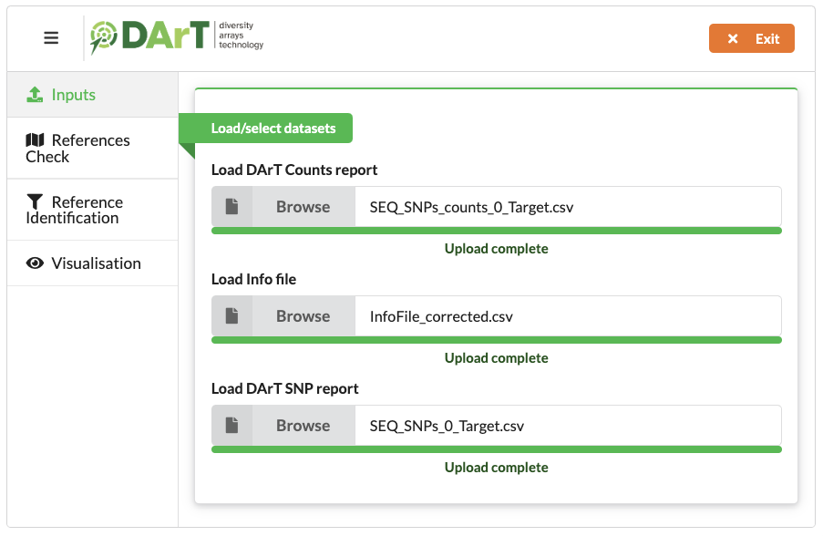
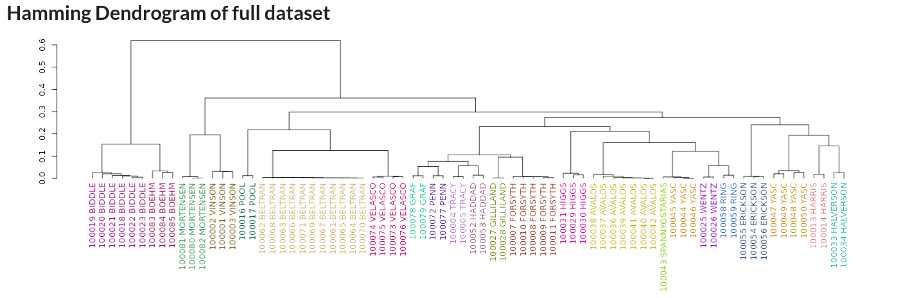
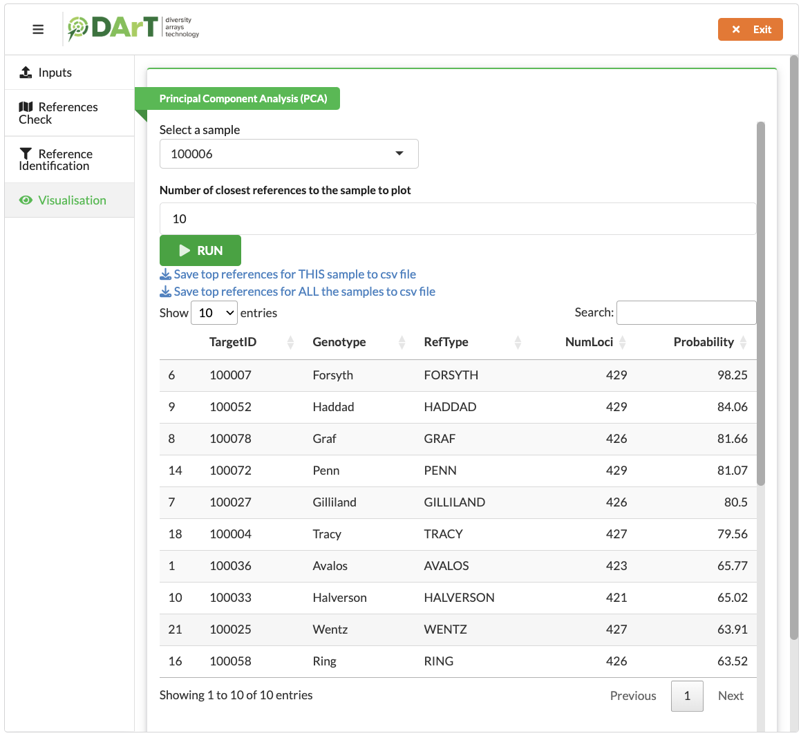

<!-- README.md is generated from README.Rmd. Please edit that file -->

```{r, include = FALSE}
knitr::opts_chunk$set(
  collapse = TRUE,
  comment = "#>",
  fig.path = "www/README-",
  out.width = "100%"
)
```
[installation_tutorial]: https://github.com/green-striped-gecko/dartR/wiki/Installation-tutorial

# <a href="https://www.diversityarrays.com/"></a>

# dartVarietalID

## Installation

dartVarietalID is at the moment in a private repository. To install it, use auth_token with a token from https://github.com/settings/tokens. 

library(devtools)

install_github("kddart/dartVarietalID", auth_token = "abc")

For dartVarietalID to work the R package dartR needs to be installed. Please consult [this installation tutorial][installation_tutorial] to install dartR.

## Example

This is how you can run the dartVarietalID app:

```{r, eval = FALSE}
library(dartVarietalID)
dartVarietalIDShiny()
```

You can open a folder with example datasets here:

```{r, eval = FALSE}
browseURL(system.file("extdata",package = "dartVarietalID"))
```


## Input Tab
<p align="center">

</p>

## References Check Tab
<p align="center">

</p>

<p align="center">

</p>

## Reference Identification Tab

<p align="center">

</p>

## Visualisation Tab

<p align="center">

</p>

<p align="center">

</p>


