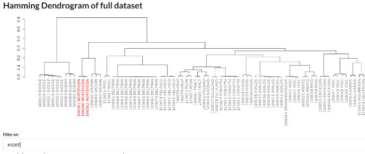
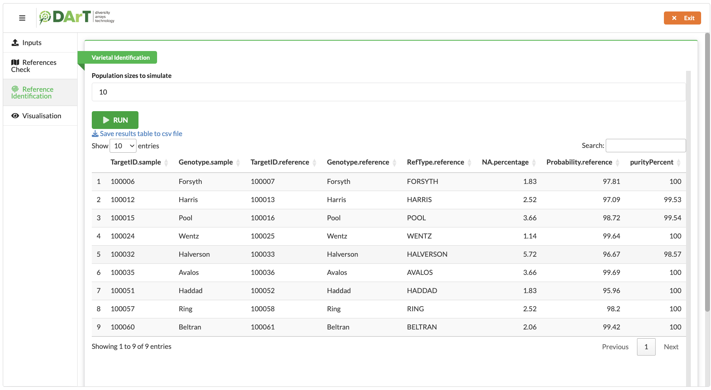

<!-- README.md is generated from README.Rmd. Please edit that file -->

# <a href="https://www.diversityarrays.com/"></a>

# dartVarietalID

## Crop sample matching using Diversity Arrays Technology (DArT) pipeline

In the agricultural sector, precise crop identification is pivotal. It
assists farmers, researchers, and agronomists in refining cultivation
practices, managing resources judiciously, advancing breeding
strategies, and tracking breeding progress. Additionally, it’s vital to
safeguard breeders’ intellectual property, establish seed certification
criteria, and adhere to agricultural regulations.

**Diversity Arrays Technology (DArT)** has developed a pipeline to
accurately match unknown crop samples with the closest known varieties,
utilising a database of reference varieties. This system is adept at
evaluating a sample’s genetic ‘purity’ by comparing its genetic profile
to that of the identified reference variety. Incorporated into an
accessible and interactive application, this pipeline leverages the R
package ‘shiny’ to enhance user experience. The application is organised
into several intuitive tabs:

1.  **Inputs**. This tab facilitates the uploading of input files into
    the application.
2.  **References Check**. Validates references to check that they are
    genetically distinguishable by highlighting problematic references
    for manual review.
3.  **Reference Identification**. Conducts calculations for matching
    probability and sample purity.
4.  **Visualisation**. Displays the closest reference varieties to the
    sample.

### Installation

dartVarietalID is at the moment in a private repository. To install it,
use auth_token with a token from the following link:
<https://github.com/settings/tokens>.

``` r
library(devtools)
install_github("kddart/dartVarietalID", auth_token = "abc")
```

For dartVarietalID to work, the R package dartR needs to be installed.
Please consult [this installation
tutorial](https://github.com/green-striped-gecko/dartR/wiki/Installation-tutorial)
to install dartR.

### Example

This is how you can run the dartVarietalID app:

``` r
library(dartVarietalID)
dartVarietalIDShiny()
```

You can open a folder with example datasets here:

``` r
browseURL(system.file("extdata",package = "dartVarietalID"))
```

## Detailed workflow

### **Inputs Tab**

Users are required to upload three CSV files:

1.  DArT counts report.
2.  Information file.
3.  DArT SNP report.

<p align="center">

</p>

The information file must contain six columns, as shown below.

<p align="center">

</p>

Columns **“RefType”** and **“SampleType”** are used to identify
references and samples. In the case of references, the column “RefType”
is filled with the name of the reference and the column “SampleType” is
left empty. In the case of samples, the colum “RefType” is left blank,
and the column “SampleType” is filled with the word “UNKNOWN”.

Files can be easily uploaded via drag-and-drop or through a file
explorer via the `Browse` button.

### **References Check Tab**

After clicking the `RUN` button, a dendrogram shows the genetic distance
between the references using the complete linkage method to find similar
clusters.

<p align="center">

</p>

An input box below allows to highlight references matching text.

<p align="center">

</p>

As part of the validation, Reference Check will scan through every
reference and warn the user of any with outside group members more
genetically similar than those within the group. For example, when
validating the example file InfoFile_problematic.csv, the variety YASC
is identified as having multiple outside references (i.e. not YASC) and
being more genetically similar than samples of variety YASC. The matrix
below shows the genetic distances of the variety YASC (rows) against
outside variety samples (columns), which have a genetic distance less
than the maximum genetic distance of samples within the variety.

<p align="center">

</p>

In this case, it is advised to separate the two YASC groups by modifying
the info file.

<p align="center">

</p>

### **Reference Identification Tab**

This step involves four stages:

1.  Simulating populations of diploid organisms.
2.  Selecting a representative individual for each sample.
3.  Calculating the matching probability of each representative
    individual to each reference.
4.  Assessing the purity of samples in relation to their best-matched
    reference.

<p align="center">

</p>

**1 Simulation of Populations of Diploid Organisms**

The program uses a simulation method to represent the genetic variation
present in both references and samples. Specifically, it creates a
population of *n* diploid individuals (i.e. organisms carrying two
copies of each chromosome) for each sample and reference. In this model,
the loci are assumed to have two alleles: a reference allele (“**A**”)
with a frequency within the population denoted by *p* and an alternative
allele (“**a**”) with a frequency within the population denoted by *q*.

For instance, a locus with 7 counts for the first allele and with 3
counts for the second allele, allele frequencies for that locus are: *p*
= 0.7 and *q* = 0.3.

To simulate each individual in each population, the program conducts a
**Bernoulli trial** (an experiment with two possible outcomes,
“*success*” and “*failure*”) for every locus. In this case, success
means inheriting allele “A”, while failure denotes inheriting allele
“a”. The probability of success and failure is given by *p* and *q*,
respectively. Since simulated individuals are diploids, the program
repeats this process twice (once for each chromosome). This way, all
loci are close to **linkage equilibrium** and **Hardy-Weinberg
equilibrium** within each simulated population. The program treats as
missing data those loci with 0 counts for allele “A” and 0 counts for
allele “a”.

**2 Selection of a Representative Individual for Each Sample**

To find the most representative individual for the simulated population
of each sample, the program first performs a **Principal Component
Analysis (PCA)**. PCA is a statistical technique used to reduce the
dimensionality of large datasets while retaining most of the variability
in the data. PCA transforms the data into linearly uncorrelated
variables known as principal components (PC). Plotting the first PC
allows each individual in the population to be represented as a point in
this reduced dimensional space. Then, the program calculates the
**Mahalanobis distance** (a measure of distance that accounts for the
variance and covariance structure of the data) of each individual from
the population’s mean (or centroid) in the PCA-transformed space. The
individual with the smallest Mahalanobis distance is deemed the most
representative of the population’s genetic diversity.

**3 Calculation of Matching Probability of Each Representative
Individual to Each Reference**

The **Hardy-Weinberg Equilibrium (HWE)** principle is used to calculate
the matching probability between a sample and a reference. HWE describes
the expected distribution of genotype frequencies in a population under
specific conditions, including random mating, a large population size,
and the absence of evolutionary forces. The equation is expressed as:

***p*<sup>2</sup> + 2 *pq* + *q*<sup>2</sup> = 1,**

where *p* and *q* denote the frequency of two alleles, referred to as
“A” and “a,” within a given population. In this context:

- ***p*<sup>2</sup>** represents the frequency of the homozygous
  genotype for the reference allele (AA).
- **2 *pq*** represents the frequency of the heterozygous genotype (Aa).
- ***q*<sup>2</sup>** represents the frequency of the homozygous
  genotype for the alternative allele (aa).

To calculate the matching probability at each locus for a representative
individual’s genotype, we look at the HWE-derived frequencies within the
reference population.

Consider a scenario where the reference population has allele
frequencies of *p* = 0.3 and *q* = 0.7. Under HWE, the population’s
genotype frequencies would be AA = ***p*<sup>2</sup>** = 0.09, Aa = **2
*pq*** = 0.42, and aa = ***q*<sup>2</sup>** = 0.49. Therefore, the
probability of a homozygous genotype for the alternative allele (aa) in
the representative individual coming from this reference population is
0.49, denoted by ***q*<sup>2</sup>**.

Should the genotype of the representative individual be non-existent in
the reference population — such as when the reference population is
fixed for one allele (AA), and the representative individual is
homozygous for the opposite allele (aa), a penalty is applied. This is
quantified by assigning a probability of -1 for that locus, signifying a
complete genetic discordance.

The overall matching probability is then derived by averaging the
probabilities across all loci after omitting any locus with missing data
to maintain the integrity of the analysis.

**4 Purity Assessment of Samples Relative to Their Best Match
Reference**

The final step involves evaluating each sample’s genetic ‘*purity*’ in
relation to its best-matched reference variety. Three calculations are
presented:

- **Absent score.** The proportion of alleles over the available marker
  set that is absent from the matched reference profile (a discretised
  representation of that variety reference), which is also absent from
  the test sample.
- **Present score.** The proportion of alleles over the available marker
  set that is present from the matched reference profile (a discretised
  representation of that variety reference), which is also present in
  the test sample.
- **Purity Percentage.** Absent score as a percentage. Under the
  assumption that we have matched the variety, purity is reduced by
  introducing additional alleles from one or more varieties, thus
  decreasing the absence score. In this case, the presence score would
  not be affected unless impurity levels were very high, i.e. many
  varieties were mixed. Therefore, the presence score is not used in
  purity calculation.

Note: Absent and present scores could be used together as a form of a
distance metric.

### **Visualisation Tab**

Utilising PCA, this tab presents the spatial genetic variation of a
sample alongside its closest references. PCA plots are interactive,
allowing rotation, zoom, and exploration of data points. Users can
export these visualisations as static images or interactive HTML files.
Additionally, tables detailing the matching probability of the top
matching references for each sample and for all the samples can be saved
in CSV format.

<p align="center">

</p>
<p align="center">

</p>
